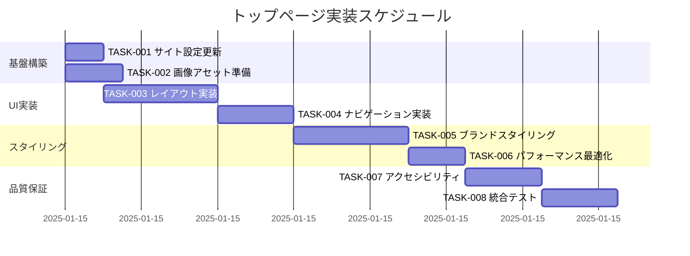

# トップページ 実装タスク

## 概要

全タスク数: 8
推定作業時間: 6時間
クリティカルパス: TASK-001 → TASK-002 → TASK-003 → TASK-004

## タスク一覧

### フェーズ1: 基盤構築・設定

#### TASK-001: サイト設定の更新

- [ ] **タスク完了**
- **タスクタイプ**: DIRECT
- **要件リンク**: REQ-002, REQ-401
- **依存タスク**: なし
- **実装詳細**:
  - `src/consts.ts`でサイトタイトルと説明文を更新
  - itzpapaブランドに適した内容に変更
  - SEO向けメタデータの設定
- **テスト要件**:
  - [ ] 設定値が正しく読み込まれることを確認
  - [ ] メタデータが適切に生成されることを確認
- **完了条件**:
  - [ ] SITE_TITLEがitzpapaブランドに更新されている
  - [ ] SITE_DESCRIPTIONが魅力的で明確な説明になっている

#### TASK-002: 画像アセットの準備

- [ ] **タスク完了**
- **タスクタイプ**: DIRECT
- **要件リンク**: REQ-001, NFR-002
- **依存タスク**: なし
- **実装詳細**:
  - itzpapa.png画像の最適化（既存ファイルの確認）
  - レスポンシブ対応用の複数サイズバリエーション作成
  - WebP形式への変換による軽量化
- **テスト要件**:
  - [ ] 画像が正しく配置されていることを確認
  - [ ] 各サイズの画像が適切に生成されることを確認
  - [ ] ファイルサイズが要件を満たすことを確認
- **完了条件**:
  - [ ] メイン画像ファイルが/public/images/に配置されている
  - [ ] レスポンシブ対応サイズが用意されている
  - [ ] 画像読み込み時間が2秒以内である

### フェーズ2: UI実装

#### TASK-003: トップページレイアウトの実装

- [ ] **タスク完了**
- **タスクタイプ**: TDD
- **要件リンク**: REQ-001, REQ-002, REQ-003, REQ-005
- **依存タスク**: TASK-001, TASK-002
- **実装詳細**:
  - `src/pages/index.astro`の全面的な書き換え
  - ブランドバナー画像の配置とレスポンシブ対応
  - セクション構造の設計（ヒーロー、紹介、ナビゲーション）
  - セマンティックHTMLによる構造化
- **UI/UX要件**:
  - [ ] ローディング状態: 画像読み込み中の適切な表示
  - [ ] エラー表示: 画像読み込み失敗時の代替表示
  - [ ] モバイル対応: 320px〜大画面までのレスポンシブデザイン
  - [ ] アクセシビリティ: 適切なalt属性、見出し階層、コントラスト比
- **テスト要件**:
  - [ ] 単体テスト: コンポーネントの正しい描画
  - [ ] 統合テスト: ヘッダー・フッターとの連携
  - [ ] レスポンシブテスト: 各ブレークポイントでの表示確認
- **完了条件**:
  - [ ] ブランドバナーが美しく表示されている
  - [ ] サイトタイトルと説明が明確に表示されている
  - [ ] レイアウトがモバイルとデスクトップで適切に動作する

#### TASK-004: ナビゲーション・導線の実装

- [ ] **タスク完了**
- **タスクタイプ**: TDD
- **要件リンク**: REQ-003, REQ-004, REQ-102
- **依存タスク**: TASK-003
- **実装詳細**:
  - 主要コンテンツセクションへのナビゲーション実装
  - ブログ記事一覧への導線作成
  - 最新記事のハイライト表示機能
  - CTAボタンとリンクの配置
- **UI/UX要件**:
  - [ ] ローディング状態: リンク先ページの読み込み状態表示
  - [ ] エラー表示: リンク切れの適切な処理
  - [ ] モバイル対応: タッチフレンドリーなボタンサイズ
  - [ ] アクセシビリティ: キーボードナビゲーション、フォーカス管理
- **テスト要件**:
  - [ ] 単体テスト: ナビゲーションリンクの動作
  - [ ] 統合テスト: ブログコンテンツとの連携
  - [ ] E2Eテスト: ユーザーフローの確認
- **完了条件**:
  - [ ] 全ナビゲーションリンクが正しく動作する
  - [ ] ブログ記事への導線が明確に表示されている
  - [ ] 最新記事がハイライト表示されている

### フェーズ3: スタイリング・最適化

#### TASK-005: ブランド統一スタイリング

- [ ] **タスク完了**
- **タスクタイプ**: TDD
- **要件リンク**: REQ-001, NFR-201, NFR-204
- **依存タスク**: TASK-004
- **実装詳細**:
  - 紫の蝶・ロータステーマに基づいたカラーパレット設計
  - タイポグラフィの統一とブランドフォントの適用
  - ボタン、カード、セクションの統一スタイル
  - アニメーション・トランジション効果の追加
- **UI/UX要件**:
  - [ ] ローディング状態: スムーズなアニメーション
  - [ ] エラー表示: ブランドに一致したエラーデザイン
  - [ ] モバイル対応: タッチに適したインタラクション
  - [ ] アクセシビリティ: WCAG 2.1 AA準拠のコントラスト比
- **テスト要件**:
  - [ ] 単体テスト: CSSクラスの適用確認
  - [ ] 統合テスト: 他ページとのスタイル統一確認
  - [ ] アクセシビリティテスト: コントラスト比測定
- **完了条件**:
  - [ ] ブランドアイデンティティが一貫して表現されている
  - [ ] カラーコントラスト比がWCAG基準を満たしている
  - [ ] アニメーション効果が適切に動作している

#### TASK-006: パフォーマンス最適化

- [ ] **タスク完了**
- **タスクタイプ**: DIRECT
- **要件リンク**: NFR-001, NFR-002, NFR-003
- **依存タスク**: TASK-005
- **実装詳細**:
  - 画像の遅延読み込み（lazy loading）実装
  - Critical CSS のインライン化
  - 不要なアセットの削除とバンドルサイズ最適化
  - プリロード・プリフェッチの設定
- **テスト要件**:
  - [ ] パフォーマンステスト: ページ読み込み時間測定
  - [ ] Lighthouseスコア測定
  - [ ] ネットワーク制限下でのテスト
- **完了条件**:
  - [ ] 初期読み込み時間が3秒以内である
  - [ ] 画像読み込み時間が2秒以内である
  - [ ] ページサイズが2MB以下である

### フェーズ4: 品質保証・統合テスト

#### TASK-007: アクセシビリティ対応

- [ ] **タスク完了**
- **タスクタイプ**: TDD
- **要件リンク**: NFR-202, NFR-203, NFR-204
- **依存タスク**: TASK-006
- **実装詳細**:
  - スクリーンリーダー対応の実装
  - キーボードナビゲーションの最適化
  - ARIA属性の適切な設定
  - フォーカス管理とスキップリンクの実装
- **テスト要件**:
  - [ ] スクリーンリーダーテスト（NVDA、JAWS）
  - [ ] キーボードナビゲーションテスト
  - [ ] 自動アクセシビリティテスト（axe-core）
- **完了条件**:
  - [ ] スクリーンリーダーで適切に読み上げられる
  - [ ] キーボードのみで全機能が操作可能である
  - [ ] ARIA属性が適切に設定されている

#### TASK-008: 統合テスト・デプロイ検証

- [ ] **タスク完了**
- **タスクタイプ**: TDD
- **要件リンク**: REQ-401, REQ-402, REQ-403
- **依存タスク**: TASK-007
- **実装詳細**:
  - 既存機能（wikilink、callout）との互換性確認
  - クロスブラウザテスト実施
  - モバイルデバイステスト実施
  - 本番環境での動作確認
- **テスト要件**:
  - [ ] 統合テスト: 既存機能の動作確認
  - [ ] E2Eテスト: ユーザーフロー全体の確認
  - [ ] クロスブラウザテスト: Chrome、Firefox、Safari、Edge
  - [ ] モバイルテスト: iOS、Android実機確認
- **エラーハンドリング**:
  - [ ] 画像読み込み失敗時の適切な代替表示
  - [ ] JavaScript無効環境でも基本機能が利用可能
  - [ ] 低速ネットワーク環境での段階的表示
- **完了条件**:
  - [ ] 全ブラウザで正しく表示・動作する
  - [ ] 既存機能との競合がない
  - [ ] モバイルデバイスで適切に動作する
  - [ ] 本番環境で安定動作している

## 実行順序

## マイルストーン

### マイルストーン1: 基盤完成 (TASK-002完了後)
- [ ] サイト設定が更新されている
- [ ] 画像アセットが準備されている
- [ ] 開発環境で基本表示が確認できる

### マイルストーン2: UI基本機能完成 (TASK-004完了後)
- [ ] ブランドバナーが適切に表示されている
- [ ] ナビゲーションが動作している
- [ ] レスポンシブデザインが基本的に動作している

### マイルストーン3: デザイン完成 (TASK-006完了後)
- [ ] ブランドアイデンティティが統一されている
- [ ] パフォーマンス要件を満たしている
- [ ] ビジュアルデザインが完成している

### マイルストーン4: プロダクション準備完了 (TASK-008完了後)
- [ ] 全要件が満たされている
- [ ] アクセシビリティ対応が完了している
- [ ] 本番環境での動作が確認されている

## 品質チェックリスト

### 機能品質
- [ ] 全要件が実装されている
- [ ] すべてのテストが通過している
- [ ] パフォーマンス要件を満たしている

### デザイン品質
- [ ] ブランドアイデンティティが適切に表現されている
- [ ] レスポンシブデザインが美しく動作している
- [ ] タイポグラフィが読みやすい

### コード品質
- [ ] 既存のコード規約に従っている
- [ ] セマンティックHTMLが使用されている
- [ ] 適切なエラーハンドリングが実装されている

### ユーザビリティ
- [ ] アクセシビリティ要件を満たしている
- [ ] モバイル対応が完了している
- [ ] 直感的な操作が可能