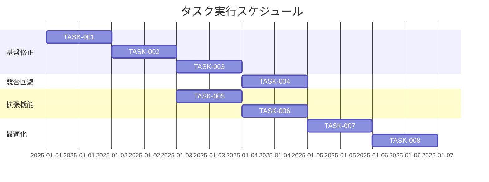

# Wikilinkスペース処理修正 実装タスク

## 概要

全タスク数: 8
推定作業時間: 6時間
クリティカルパス: TASK-001 → TASK-002 → TASK-003 → TASK-005

## タスク一覧

### フェーズ1: 基盤修正（高優先度）

#### TASK-001: スペース→ハイフン変換機能の実装

- [x] **タスク完了**
- **タスクタイプ**: TDD
- **要件リンク**: REQ-001, REQ-101
- **依存タスク**: なし
- **実装詳細**:
  - `getDisplayName`関数でスペース→ハイフン変換ロジック追加
  - パス部分のスペース正規化処理
  - 既存の正規表現パターンの拡張
- **テスト要件**:
  - [x] 単体テスト: `[[page name]]` → `/blog/page-name`
  - [x] 単体テスト: `[[My Page Name]]` → `/blog/my-page-name`
  - [x] 回帰テスト: 既存のwikilinkテストが通過する
- **完了条件**:
  - [x] スペースを含むパスが適切にハイフン変換される
  - [x] 既存のテストが全て通過する

#### TASK-002: 先頭・末尾空白の除去実装

- [x] **タスク完了**
- **タスクタイプ**: TDD
- **要件リンク**: REQ-004
- **依存タスク**: TASK-001
- **実装詳細**:
  - `trim()`処理をパス解析前に追加
  - 先頭・末尾空白の自動除去ロジック
  - エイリアス部分は空白を保持
- **テスト要件**:
  - [x] 単体テスト: `[[  page name  ]]` → `/blog/page-name`
  - [x] 単体テスト: `[[  page  |  Display Name  ]]` → エイリアス空白保持
  - [x] 境界値テスト: タブ文字、改行文字の処理
- **完了条件**:
  - [x] 先頭・末尾空白が自動除去される
  - [x] エイリアス部分の空白は保持される

#### TASK-003: 見出しアンカーのスペース処理改善

- [x] **タスク完了**
- **タスクタイプ**: TDD
- **要件リンク**: REQ-002, REQ-102
- **依存タスク**: TASK-002
- **実装詳細**:
  - 見出しアンカー部分のスペース→ハイフン変換
  - 小文字化処理の追加
  - 日本語文字を含む見出しの適切な処理
- **テスト要件**:
  - [x] 単体テスト: `[[page#Test Heading]]` → `/blog/page#test-heading`
  - [x] 単体テスト: `[[page#日本語 見出し]]` → `/blog/page#日本語-見出し`
  - [x] 統合テスト: エイリアス付き見出しリンク
- **完了条件**:
  - [x] 見出しアンカーのスペースが適切に処理される
  - [x] 日本語と英語の混在見出しが正しく動作する

### フェーズ2: 競合回避・正規化（高優先度）

#### TASK-004: テーブル内パイプ文字競合回避

- [x] **タスク完了**
- **タスクタイプ**: TDD
- **要件リンク**: REQ-103, REQ-202
- **依存タスク**: TASK-003
- **実装詳細**:
  - 既存の`<<<PIPE>>>`マーカー機能の改善
  - テーブルコンテキスト検出の強化
  - パイプ文字の一時的置換処理の拡張
- **テスト要件**:
  - [x] 単体テスト: テーブル内wikilinkの正常動作
  - [x] 統合テスト: 複雑なテーブル構造でのwikilink
  - [x] 回帰テスト: 既存のテーブルテストが通過する
- **エラーハンドリング**:
  - [x] ネストしたテーブル構造での処理
  - [x] 不正なパイプ文字の処理
- **完了条件**:
  - [x] テーブル内でwikilinkが正常に動作する
  - [x] パイプ文字の競合が発生しない

### フェーズ3: 拡張機能（中優先度）

#### TASK-005: 連続スペース正規化

- [ ] **タスク完了**
- **タスクタイプ**: TDD
- **要件リンク**: REQ-104
- **依存タスク**: TASK-002
- **実装詳細**:
  - 連続スペースの単一セパレータへの正規化
  - `replace(/\s+/g, '-')`による一括処理
  - Unicode空白文字への対応
- **テスト要件**:
  - [ ] 単体テスト: `[[page   name]]` → `/blog/page-name`
  - [ ] 境界値テスト: 100個連続スペース
  - [ ] Unicode空白文字テスト: 全角スペース、タブ等
- **完了条件**:
  - [ ] 連続スペースが単一セパレータに正規化される
  - [ ] Unicode空白文字が適切に処理される

#### TASK-006: 日本語文字セット対応強化

- [ ] **タスク完了**
- **タスクタイプ**: TDD
- **要件リンク**: REQ-403, EDGE-201
- **依存タスク**: TASK-005
- **実装詳細**:
  - UTF-8日本語文字の適切な処理
  - 全角スペース（U+3000）への対応
  - 混在文字セットでのURL生成改善
- **テスト要件**:
  - [ ] 単体テスト: 全角スペースの処理
  - [ ] 統合テスト: 英数字+日本語+スペースの組み合わせ
  - [ ] エンコーディングテスト: UTF-8文字の保持
- **完了条件**:
  - [ ] 日本語文字が適切に処理される
  - [ ] 混在文字セットが正しく動作する

### フェーズ4: エラーハンドリング・最適化（中優先度）

#### TASK-007: 基本的なエラーハンドリング

- [ ] **タスク完了**
- **タスクタイプ**: TDD
- **要件リンク**: EDGE-001, EDGE-003, NFR-201
- **依存タスク**: TASK-006
- **実装詳細**:
  - 空白のみのパス（`[[   ]]`）の無効化
  - 無効な文字を含むパスの検出
  - 適切なエラーメッセージの提供
- **テスト要件**:
  - [ ] エラーケーステスト: 空白のみのパス
  - [ ] エラーケーステスト: 制御文字を含むパス
  - [ ] ユーザビリティテスト: エラーメッセージの明確性
- **エラーハンドリング**:
  - [ ] 無効なwikilink形式の検出
  - [ ] グレースフル・デグラデーション
  - [ ] デバッグ情報の提供
- **完了条件**:
  - [ ] 無効な入力が適切に処理される
  - [ ] エラーメッセージが理解しやすい

#### TASK-008: パフォーマンス最適化・テスト拡張

- [ ] **タスク完了**
- **タスクタイプ**: TDD
- **要件リンク**: NFR-001, NFR-002
- **依存タスク**: TASK-007
- **実装詳細**:
  - 正規表現の最適化
  - 大量wikilinkでのパフォーマンステスト
  - メモリ使用量の監視
- **テスト要件**:
  - [ ] パフォーマンステスト: 1000個wikilinkの処理時間測定
  - [ ] 負荷テスト: 連続処理での性能確認
  - [ ] メモリテスト: メモリリークの確認
- **完了条件**:
  - [ ] 性能低下が5%以下に抑えられている
  - [ ] 大量データでも応答時間1秒以内
  - [ ] 拡張テストスイートが整備されている

## 実行順序

## 実装方針

### TDDプロセス

各TDDタスクは以下の手順で実装:

1. **要件分析**: 該当するREQ/NFR/EDGEの詳細分析
2. **テストケース設計**: 失敗するテストの作成
3. **最小実装**: テストを通すための最小限のコード
4. **リファクタリング**: コード品質の向上
5. **統合テスト**: 他の機能との連携確認

### ファイル変更スコープ

- **メイン実装**: `src/plugins/remark-wikilink/index.js`
- **テスト拡張**: `test/wikilink-test.js`
- **動作確認**: `src/content/blog/wikilink-test/index.md`

### 品質保証

- **回帰テスト**: 既存のwikilinkテストスイートが常に通過
- **新機能テスト**: 各タスクで対応する機能の詳細テスト
- **統合テスト**: 全機能の組み合わせテスト
- **パフォーマンステスト**: 性能要件の確認

## 成功基準

- [ ] 全36個の受け入れ基準が満たされている
- [ ] 既存のwikilinkテストが100%通過している
- [ ] 新しいスペース関連テストが全て通過している
- [ ] パフォーマンス要件（5%以下の性能低下）が満たされている
- [ ] エラーハンドリングが適切に動作している