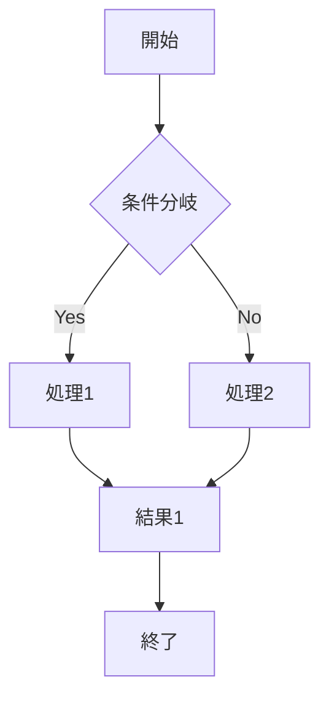
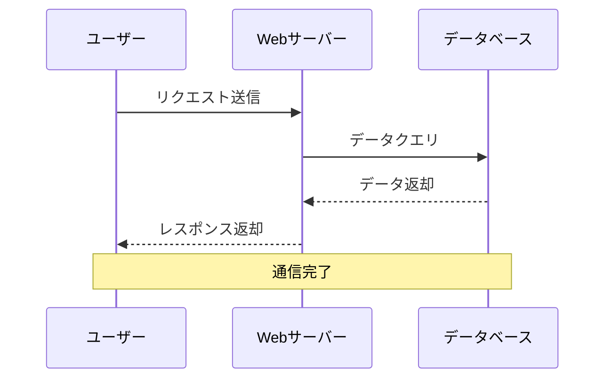
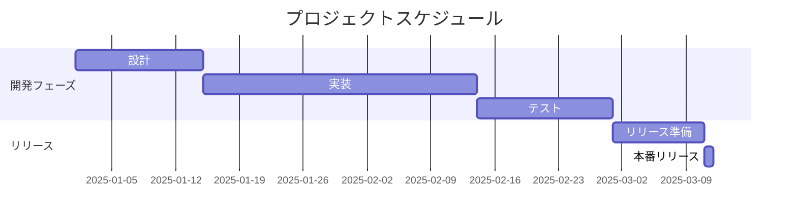
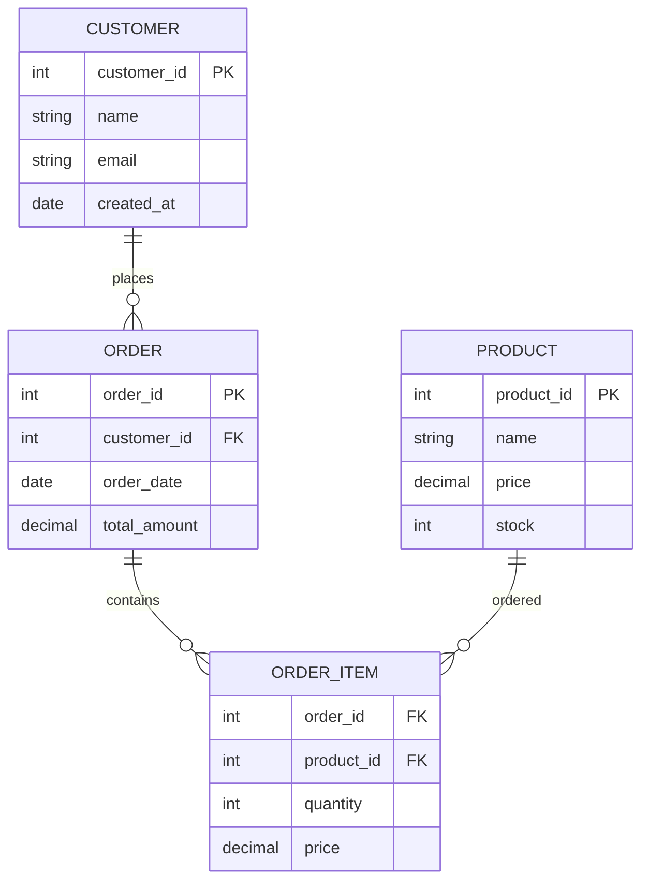
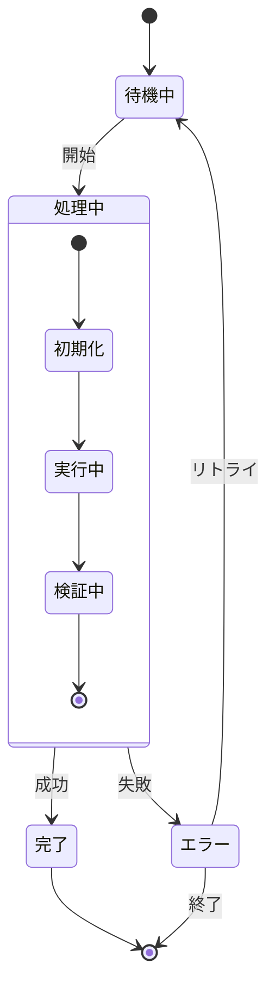
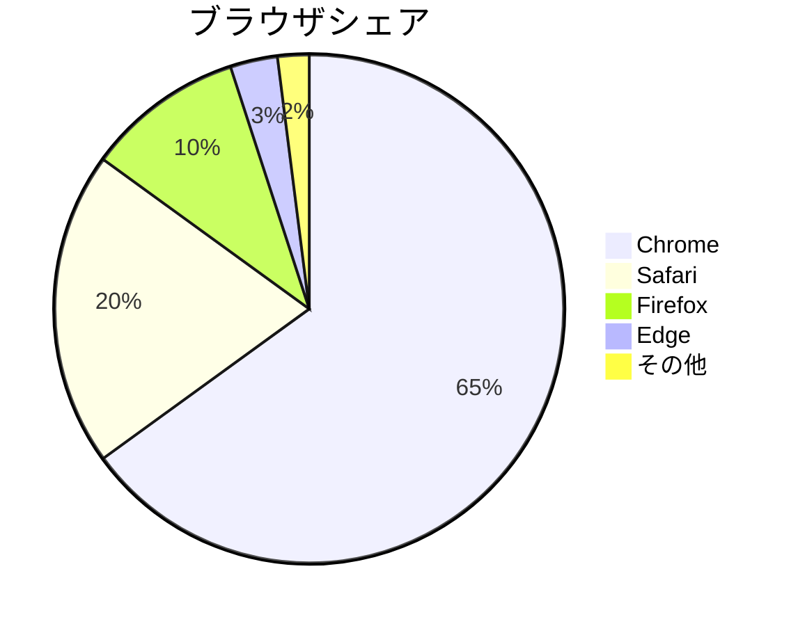
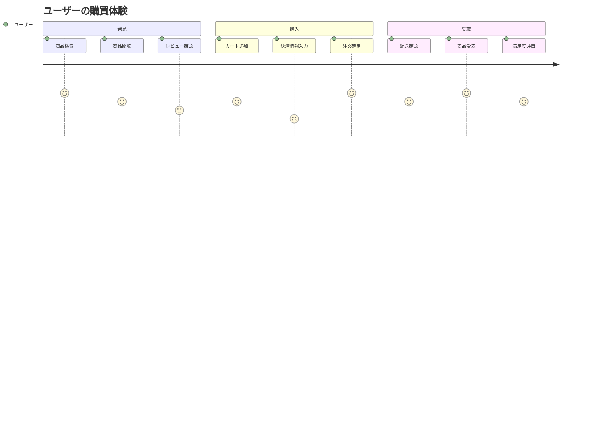
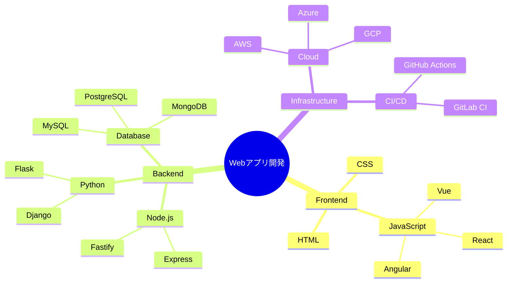

# Mermaidダイアグラムのテスト

このページでは、Mermaidによる各種ダイアグラムの表示機能を確認します。フローチャート、シーケンス図、ガントチャートなど様々な図表をテストします。

## 1. フローチャート

#### Syntax

````markdown

````

#### Output


## 2. シーケンス図

#### Syntax

````markdown

````

#### Output


## 3. ガントチャート

#### Syntax

````markdown

````

#### Output


## 4. クラス図

#### Syntax

````markdown
```mermaid
classDiagram
    class User {
        +String name
        +String email
        +login()
        +logout()
    }
    
    class Post {
        +String title
        +String content
        +Date publishDate
        +publish()
        +edit()
    }
    
    class Comment {
        +String content
        +Date createdAt
        +create()
        +delete()
    }
    
    User ||--o{ Post : creates
    Post ||--o{ Comment : has
    User ||--o{ Comment : writes
```
````

#### Output

```mermaid
classDiagram
    class User {
        +String name
        +String email
        +login()
        +logout()
    }
    
    class Post {
        +String title
        +String content
        +Date publishDate
        +publish()
        +edit()
    }
    
    class Comment {
        +String content
        +Date createdAt
        +create()
        +delete()
    }
    
    User ||--o{ Post : creates
    Post ||--o{ Comment : has
    User ||--o{ Comment : writes
```

## 5. ER図

#### Syntax

````markdown

````

#### Output


## 6. 状態遷移図

#### Syntax

````markdown

````

#### Output


## 7. パイチャート

#### Syntax

````markdown

````

#### Output


## 8. Git図

#### Syntax

````markdown
```mermaid
gitgraph
    commit id: "初期コミット"
    branch feature
    checkout feature
    commit id: "機能A実装"
    commit id: "バグ修正"
    checkout main
    commit id: "ホットフィックス"
    merge feature
    commit id: "リリース v1.0"
    branch bugfix
    checkout bugfix
    commit id: "緊急修正"
    checkout main
    merge bugfix
    commit id: "v1.0.1"
```
````

#### Output

```mermaid
gitgraph
    commit id: "初期コミット"
    branch feature
    checkout feature
    commit id: "機能A実装"
    commit id: "バグ修正"
    checkout main
    commit id: "ホットフィックス"
    merge feature
    commit id: "リリース v1.0"
    branch bugfix
    checkout bugfix
    commit id: "緊急修正"
    checkout main
    merge bugfix
    commit id: "v1.0.1"
```

## 9. ユーザージャーニー

#### Syntax

````markdown

````

#### Output


## 10. マインドマップ

#### Syntax

````markdown

````

#### Output


## 11. Callout内のMermaid図

#### Syntax

````markdown
> [!note] システム構成図
> 以下は基本的なWebアプリケーションの構成です：
> 
> ```mermaid
> flowchart LR
>     A[ユーザー] --> B[ロードバランサー]
>     B --> C[Webサーバー1]
>     B --> D[Webサーバー2]
>     C --> E[データベース]
>     D --> E
> ```

> [!tip] 開発プロセス
> アジャイル開発のスプリント計画：
> 
> ```mermaid
> gantt
>     title スプリント1
>     dateFormat  YYYY-MM-DD
>     section 計画
>     バックログ整理   :2025-01-01, 2d
>     見積もり         :2025-01-03, 1d
>     section 開発
>     実装           :2025-01-04, 7d
>     テスト         :2025-01-11, 3d
> ```
````

#### Output

> [!note] システム構成図
> 以下は基本的なWebアプリケーションの構成です：
> 
> ```mermaid
> flowchart LR
>     A[ユーザー] --> B[ロードバランサー]
>     B --> C[Webサーバー1]
>     B --> D[Webサーバー2]
>     C --> E[データベース]
>     D --> E
> ```

> [!tip] 開発プロセス
> アジャイル開発のスプリント計画：
> 
> ```mermaid
> gantt
>     title スプリント1
>     dateFormat  YYYY-MM-DD
>     section 計画
>     バックログ整理   :2025-01-01, 2d
>     見積もり         :2025-01-03, 1d
>     section 開発
>     実装           :2025-01-04, 7d
>     テスト         :2025-01-11, 3d
> ```

## 12. 複雑なフローチャート

#### Syntax

````markdown
```mermaid
flowchart TD
    Start([開始]) --> Input[ユーザー入力]
    Input --> Validate{入力検証}
    Validate -->|Valid| Process[データ処理]
    Validate -->|Invalid| Error[エラー表示]
    Error --> Input
    
    Process --> Save{保存処理}
    Save -->|Success| Notify[成功通知]
    Save -->|Failed| Retry{リトライ?}
    
    Retry -->|Yes| Process
    Retry -->|No| ErrorLog[エラーログ記録]
    ErrorLog --> End([終了])
    
    Notify --> Cleanup[クリーンアップ]
    Cleanup --> End
    
    style Start fill:#90EE90
    style End fill:#FFB6C1
    style Error fill:#FFA07A
    style ErrorLog fill:#FFA07A
```
````

#### Output

```mermaid
flowchart TD
    Start([開始]) --> Input[ユーザー入力]
    Input --> Validate{入力検証}
    Validate -->|Valid| Process[データ処理]
    Validate -->|Invalid| Error[エラー表示]
    Error --> Input
    
    Process --> Save{保存処理}
    Save -->|Success| Notify[成功通知]
    Save -->|Failed| Retry{リトライ?}
    
    Retry -->|Yes| Process
    Retry -->|No| ErrorLog[エラーログ記録]
    ErrorLog --> End([終了])
    
    Notify --> Cleanup[クリーンアップ]
    Cleanup --> End
    
    style Start fill:#90EE90
    style End fill:#FFB6C1
    style Error fill:#FFA07A
    style ErrorLog fill:#FFA07A
```

## まとめ

Mermaidダイアグラムは、様々な図表を簡単にMarkdownで記述できる強力なツールです。この記事では以下のダイアグラムタイプをテストしました：

- **フローチャート**: プロセスフローの可視化
- **シーケンス図**: システム間の相互作用
- **ガントチャート**: プロジェクトスケジュール
- **クラス図**: オブジェクト指向設計
- **ER図**: データベース設計
- **状態遷移図**: システムの状態変化
- **パイチャート**: データの割合表示
- **Git図**: バージョン管理の可視化
- **ユーザージャーニー**: ユーザー体験の可視化
- **マインドマップ**: アイデアの階層構造

これらの機能により、技術文書やプレゼンテーション資料を効果的に作成できます。